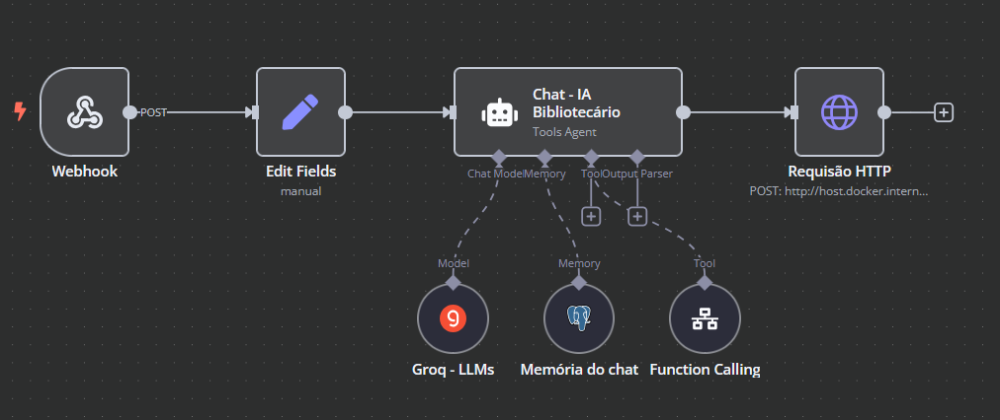
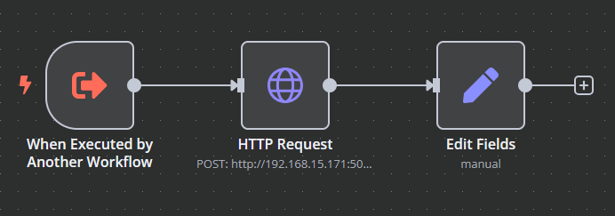

# Chat Bibliotecário

O **Chat Bibliotecário** é uma aplicação desenvolvida para auxiliar usuários na busca por informações de forma automatizada, ajudando pessoas com escolhas de livros que melhor se encaixa em seus estudos diários, utilizando processamento de linguagem natural. A aplicação integra diferentes tecnologias para oferecer um chatbot eficiente e responsivo.

## Tecnologias Utilizadas e Suas Funções

- **Python (Flask)** - Responsável por criar a API que processa as requisições do chatbot.
- **n8n** - Orquestração de fluxos automatizados e integração entre serviços.
- **EvolutionAPI** - Processamento avançado para interpretação das consultas.
- **PostgreSQL (Supabase)** - Banco de dados utilizado para armazenamento das informações do chatbot.
- **Docker** - Facilita a implantação e execução dos serviços em containers.

---

## Python (Flask) - API de Consulta de Livros

A API desenvolvida em Flask recebe uma requisição contendo um tema e retorna uma lista de livros relacionados, utilizando a API do Google Books:

```python
from flask import Flask, request, jsonify
import requests

app = Flask(__name__)

def buscar_livros(tema):
    api_key = 'SUA_API_KEY'
    url = f"https://www.googleapis.com/books/v1/volumes?q={tema}&key={api_key}"
    resposta = requests.get(url)
    dados = resposta.json()

    livros = []
    for item in dados.get("items", [])[:5]:
        info = item["volumeInfo"]
        livros.append({
            "titulo": info.get("title", "Titulo não disponível"),
            "autor": ", ".join(info.get("authors", ["Autor desconhecido"])),
            "sinopse": info.get("description", "Sem descrição disponível")
        })
    
    return livros

@app.route("/buscar_livros",methods=["POST"])
def api_buscar_livros():
    dados = request.json
    tema = dados.get("tema")
    if not tema:
        return jsonify({"erro": "É necessário informar um tema"}), 400
    
    resultado = buscar_livros(tema)
    return jsonify(resultado)

if __name__ == "__main__":
    app.run(host="0.0.0.0", port=5000)
```

---

## n8n - Orquestração do Chatbot

O n8n é utilizado para gerenciar o fluxo de interação do chatbot, processando as perguntas dos usuários e direcionando para a API correta.

**Fluxo do n8n:**



**Fluxo do n8n:**



---

## EvolutionAPI

A EvolutionAPI é utilizada para processamento avançado de linguagem natural, interpretando perguntas complexas e estruturando melhor as respostas do chatbot.

---

## PostgreSQL (Supabase)

O Supabase fornece o banco de dados PostgreSQL onde são armazenadas informações sobre interações e histórico de perguntas do chatbot.

---

## Docker - Containerização dos Serviços

A aplicação está containerizada com Docker para facilitar a implantação em diferentes ambientes. Os serviços rodam nas seguintes portas:

- Flask API: `5000`
- n8n: `5678`
- EvolutionAPI: `8080`

---

## Como Rodar o Projeto Localmente

### 1. Pré-requisitos

Antes de começar, certifique-se de ter instalado:

- [Docker](https://www.docker.com/)
- [Docker Compose](https://docs.docker.com/compose/)

### 2. Configuração do Supabase

1. Acesse [Supabase](https://supabase.com/)
2. Crie um novo projeto
3. Copie as credenciais do banco de dados (URL, usuário, senha)
4. Configure essas credenciais no seu `.env` (ver passo 4)

### 3. Clone o repositório

```sh
git clone https://github.com/seu-usuario/chat-bibliotecario.git
cd chat-bibliotecario
```

### 4. Configurar variáveis de ambiente

Crie um arquivo `.env` na raiz do projeto e adicione as credenciais do banco:

```ini
POSTGRES_URL=sua-url-do-supabase
POSTGRES_USER=seu-usuario
POSTGRES_PASSWORD=sua-senha
POSTGRES_DB=seu-banco
```

### 5. Subir os containers com Docker

Execute o comando abaixo para iniciar os serviços:

```sh
docker-compose up --build
```

Isso iniciará:
- A API do chatbot
- O serviço de automação n8n (porta 5678)
- O serviço EvolutionAPI (porta 8080)

### 6. Acesse os serviços

- Chat Bibliotecário: `http://localhost:5000`
- n8n: `http://localhost:5678`
- EvolutionAPI: `http://localhost:8080`

### 7. Testar a API

Você pode testar a API usando `curl` ou ferramentas como Postman.

```sh
curl -X POST http://localhost:5000/buscar_livros -d '{"tema": "Tecnologia"}' -H "Content-Type: application/json"
```

---

## Contribuição

Sinta-se à vontade para contribuir com o projeto. Para isso:

1. Faça um fork do repositório
2. Crie uma branch (`git checkout -b feature-minha-feature`)
3. Faça suas alterações e commit (`git commit -m 'Minha nova feature'`)
4. Envie um push (`git push origin feature-minha-feature`)
5. Abra um Pull Request

---

## Licença

Este projeto está sob a licença MIT. Para mais detalhes, consulte o arquivo `LICENSE`.

---

### Autor

Desenvolvido por **Ismael - IS7 Tech** 🚀